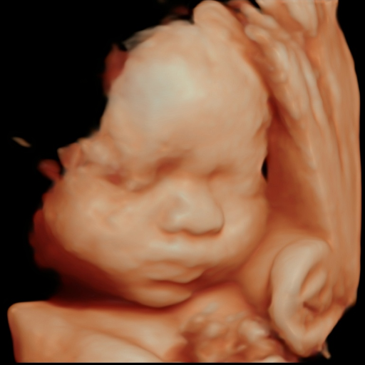
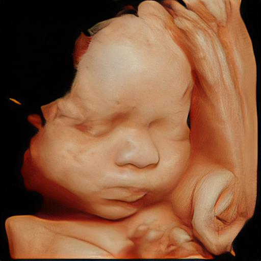

# 基于PSFRGAN的超声重建图像深度学习算法优化

> **PSFRGAN 原文及作者**
>
> [Progressive Semantic-Aware Style Transformation for Blind Face Restoration](https://arxiv.org/abs/2009.08709)  
> [Chaofeng Chen](https://chaofengc.github.io), [Xiaoming Li](https://csxmli2016.github.io/), [Lingbo Yang](https://lotayou.github.io), [Xianhui Lin](https://dblp.org/pid/147/7708.html), [Lei Zhang](https://www4.comp.polyu.edu.hk/~cslzhang/), [Kwan-Yee K. Wong](https://i.cs.hku.hk/~kykwong/)
>
> 本项目基于[PSFR-GAN](https://arxiv.org/abs/2009.08709)完成。
> 查看原始项目说明，参见 `Original-README.md` ；查看原始PSFRGAN项目，参见[此处](https://github.com/chaofengc/PSFRGAN)。

<center><b>超声重建图像处理前后对比</b></center>

<center>
	
</center>


## 环境要求

- CUDA 10.1

- Python 3.7， 可以使用以下命令来安装依赖的库：

  `pip install -r requirements.txt`

- 下载预训练模型：

  - [BaiduNetDisk](https://pan.baidu.com/s/1R2NCCvpTUPouiFfuIw88kA)，提取码：`y7in`。
  - 将所有预训练模型放置在路径 `./pretrain_models` 下。

## 测试运行

所有输入图片应为 `512 * 512` 像素的rgb图片。

使用以下命令来测试运行：

```
python test_enhance_single_unalign.py --test_img_path ./test_dir/147.png --results_dir test_result --gpus 1
```

- `--test_img_path` 为输入图片的位置。
- `--result_dir` 为输出结果的路径。
  - `test_results/LQ_faces` 为需要处理的低通图像。
  - `test_results/ParseMaps` 为低通图像的语义图。
  - `test_results/HQ` 为处理结果。
- `--gpus` 为需要使用的GPU，`<=0` 表示使用CPU来运行。
- 使用 Nvidia GTX1060 6GB 显卡进行处理，单张 512 * 512 的图片需要约3.02秒，峰值显存占用约1.8GB。
- 使用 Intel Core i7-8700 CPU 进行处理，单张 512 * 512 的图片需要约6.37秒，峰值CPU占用率约71%。

## 训练模型

### 准备训练数据

- 将数据集中的数据放在`../datasets/reconstructed_ultrasound_images/imgs1024` 路径下，所有训练数据的长宽比应为**1：1**。

- 运行以下命令，生成对应的语义图：

  ```
  python generate_masks.py --test_img_path ../datasets/reconstructed_ultrasound_images/imgs1024 --results_dir ../datasets/reconstructed_ultrasound_images/masks512
  ```
  
- 本项目使用三维超声重建图像数据下载：
  - [BaiduNetDisk](https://pan.baidu.com/s/1GYQV59jofjjeZBxU5RYTYg)，提取码：`j0xs`。

### 训练PSFRGAN

使用以下命令来训练PSFRGAN：

```
python train.py --gpus 1 --model enhance --name PSFRGAN_v001 --g_lr 0.0001 --d_lr 0.0004 --beta1 0.5 --gan_mode hinge --lambda_pix 10 --lambda_fm 10 --lambda_ss 1000 --Dinput_nc 22 --D_num 3 --n_layers_D 4 --batch_size 2 --dataroot ../datasets/reconstructed_ultrasound_images --visual_freq 100 --print_freq 10 --dataset ffhq
```

- 对于不同的实验，需要更改`--name` 选项。相同名字的实验结果会被覆盖。
- `--gpus` 表示训练需要使用的GPU数量。有更多的显存的GPU将会被优先使用。可以在训练之前，运行以下命令来指定GPU的id： `export CUDA_VISIBLE_DEVICES=your_gpu_ids`。
- `--continue_train` 表示是否继续训练。在上面的命令中加上这个标识，将会自动在指定的路径中继续训练之前的模型。
- 当**batch_size=1**时，需要至少**8GB**的显存才能够完成训练。

## 评测结果

使用以下命令可以用PSNR和SSIM指标评测生成的结果：

```
python measure.py --test_dir test_result --ground_truth_dir ground_truth
```

- 此处 `test_result` 和 `ground_truth_dir` 都必须为您自己的路径。
- `test_result` 和 `ground_truth_dir` 中的文件名必须一一对应。
- 运行上面的指令可以输出测试路径中所有图像和Ground Truth路径中所有图像的 PSNR 和 SSIM 的平均值与方差。

## License

<a rel="license" href="http://creativecommons.org/licenses/by-nc-sa/4.0/"></a>

This work is licensed under a <a rel="license" href="http://creativecommons.org/licenses/by-nc-sa/4.0/">Creative Commons Attribution-NonCommercial-ShareAlike 4.0 International License</a>.

